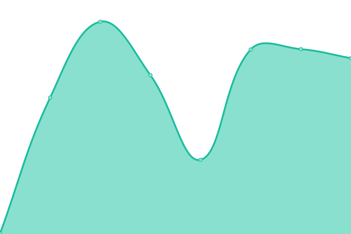

# [📈 Live Status](https://status.themanaworld.org): <!--live status--> **🟩 All systems operational**

This repository contains the open-source uptime monitor and status page for [The Mana World](https://themanaworld.org/), powered by [Upptime](https://github.com/upptime/upptime).

With [Upptime](https://upptime.js.org), you can get your own unlimited and free uptime monitor and status page, powered entirely by a GitHub repository. We use [Issues](https://github.com/themanaworld/upptime/issues) as incident reports, [Actions](https://github.com/themanaworld/upptime/actions) as uptime monitors, and [Pages](https://status.themanaworld.org) for the status page.

<!--start: status pages-->
<!-- This summary is generated by Upptime (https://github.com/upptime/upptime) -->
<!-- Do not edit this manually, your changes will be overwritten -->
<!-- prettier-ignore -->
| URL | Status | History | Response Time | Uptime |
| --- | ------ | ------- | ------------- | ------ |
|  [[Render] Homepage](https://www.themanaworld.org) | 🟩 Up | [render-homepage.yml](https://github.com/themanaworld/upptime/commits/HEAD/history/render-homepage.yml) | 

 513ms
     
 | 

<a href="https://status.themanaworld.org/history/render-homepage">100.00%</a>
    

|  [[Render] Policies](https://policies.themanaworld.org) | 🟩 Up | [render-policies.yml](https://github.com/themanaworld/upptime/commits/HEAD/history/render-policies.yml) | 

 534ms
     
 | 

<a href="https://status.themanaworld.org/history/render-policies">100.00%</a>
    

|  [[Render] Vault](https://vault.themanaworld.org) | 🟩 Up | [render-vault.yml](https://github.com/themanaworld/upptime/commits/HEAD/history/render-vault.yml) | 

 453ms
     
 | 

<a href="https://status.themanaworld.org/history/render-vault">100.00%</a>
    

|  [Azure] Azure VM | 🟩 Up | [azure-azure-vm.yml](https://github.com/themanaworld/upptime/commits/HEAD/history/azure-azure-vm.yml) | 

 115ms
     
 | 

<a href="https://status.themanaworld.org/history/azure-azure-vm">100.00%</a>
    

|  [[Azure] Forums](https://forums.themanaworld.org) | 🟩 Up | [azure-forums.yml](https://github.com/themanaworld/upptime/commits/HEAD/history/azure-forums.yml) | 

 915ms
     
 | 

<a href="https://status.themanaworld.org/history/azure-forums">100.00%</a>
    

|  [[Azure] Wiki](https://wiki.themanaworld.org) | 🟩 Up | [azure-wiki.yml](https://github.com/themanaworld/upptime/commits/HEAD/history/azure-wiki.yml) | 

 996ms
     
 | 

<a href="https://status.themanaworld.org/history/azure-wiki">100.00%</a>
    

|  [[Azure] API (registration, password resets, etc)](https://api.themanaworld.org/api/tmwa/server) | 🟩 Up | [azure-api-registration-password-resets-etc.yml](https://github.com/themanaworld/upptime/commits/HEAD/history/azure-api-registration-password-resets-etc.yml) | 

 634ms
     
 | 

<a href="https://status.themanaworld.org/history/azure-api-registration-password-resets-etc">100.00%</a>
    

|  [[Azure] Mana Launcher](https://api.themanaworld.org:13370/status/ping) | 🟩 Up | [azure-mana-launcher.yml](https://github.com/themanaworld/upptime/commits/HEAD/history/azure-mana-launcher.yml) | 

 467ms
     
 | 

<a href="https://status.themanaworld.org/history/azure-mana-launcher">100.00%</a>
    

|  [Azure] Legacy server | 🟩 Up | [azure-legacy-server.yml](https://github.com/themanaworld/upptime/commits/HEAD/history/azure-legacy-server.yml) | 

 115ms
     
 | 

<a href="https://status.themanaworld.org/history/azure-legacy-server">100.00%</a>
    

|  [Azure] Legacy Test server | 🟩 Up | [azure-legacy-test-server.yml](https://github.com/themanaworld/upptime/commits/HEAD/history/azure-legacy-test-server.yml) | 

 116ms
     
 | 

<a href="https://status.themanaworld.org/history/azure-legacy-test-server">100.00%</a>
    

|  [Azure] rEvolt server | 🟩 Up | [azure-r-evolt-server.yml](https://github.com/themanaworld/upptime/commits/HEAD/history/azure-r-evolt-server.yml) | 

 116ms
     
 | 

<a href="https://status.themanaworld.org/history/azure-r-evolt-server">100.00%</a>
    

|  [Azure] Crossroads server | 🟩 Up | [azure-crossroads-server.yml](https://github.com/themanaworld/upptime/commits/HEAD/history/azure-crossroads-server.yml) | 

 116ms
     
 | 

<a href="https://status.themanaworld.org/history/azure-crossroads-server">100.00%</a>
    

|  [[OVH] Serenata](http://serenata.tmw2.org) | 🟩 Up | [ovh-serenata.yml](https://github.com/themanaworld/upptime/commits/HEAD/history/ovh-serenata.yml) | 

 349ms
     
 | 

<a href="https://status.themanaworld.org/history/ovh-serenata">100.00%</a>
    

|  [[FRS] ManaVerse](https://manaplus.germantmw.de) | 🟩 Up | [frs-mana-verse.yml](https://github.com/themanaworld/upptime/commits/HEAD/history/frs-mana-verse.yml) | 

 626ms
     
 | 

<a href="https://status.themanaworld.org/history/frs-mana-verse">100.00%</a>
    

|  [[Yandex] inbound mail](mx.yandex.net) | 🟩 Up | [yandex-inbound-mail.yml](https://github.com/themanaworld/upptime/commits/HEAD/history/yandex-inbound-mail.yml) | 

 194ms
     
 | 

<a href="https://status.themanaworld.org/history/yandex-inbound-mail">100.00%</a>
    

|  [[Yandex] outbound mail](smtp.yandex.com) | 🟩 Up | [yandex-outbound-mail.yml](https://github.com/themanaworld/upptime/commits/HEAD/history/yandex-outbound-mail.yml) | 

 215ms
     
 | 

<a href="https://status.themanaworld.org/history/yandex-outbound-mail">100.00%</a>
    

|  [[Shivtr] Crew of Red Corsair](http://crc.themanaworld.org) | 🟩 Up | [shivtr-crew-of-red-corsair.yml](https://github.com/themanaworld/upptime/commits/HEAD/history/shivtr-crew-of-red-corsair.yml) | 

 391ms
     
 | 

<a href="https://status.themanaworld.org/history/shivtr-crew-of-red-corsair">99.86%</a>
    

|  [[IRC] Libera Chat](irc.libera.chat) | 🟩 Up | [irc-libera-chat.yml](https://github.com/themanaworld/upptime/commits/HEAD/history/irc-libera-chat.yml) | 

 109ms
     
 | 

<a href="https://status.themanaworld.org/history/irc-libera-chat">100.00%</a>
    

|  [[Discord] Discord API](https://discord.com/api/v9) | 🟩 Up | [discord-discord-api.yml](https://github.com/themanaworld/upptime/commits/HEAD/history/discord-discord-api.yml) | 

 148ms
     
 | 

<a href="https://status.themanaworld.org/history/discord-discord-api">100.00%</a>
    

|  [[Gitlab] Gitlab](https://git.themanaworld.org/explore) | 🟩 Up | [gitlab-gitlab.yml](https://github.com/themanaworld/upptime/commits/HEAD/history/gitlab-gitlab.yml) | 

 815ms
     
 | 

<a href="https://status.themanaworld.org/history/gitlab-gitlab">100.00%</a>
    

|  [[Agnus] Lightweight Gitlab Runner](alumni.cacic.bsb.br) | 🟩 Up | [agnus-lightweight-gitlab-runner.yml](https://github.com/themanaworld/upptime/commits/HEAD/history/agnus-lightweight-gitlab-runner.yml) | 

 169ms
     
 | 

<a href="https://status.themanaworld.org/history/agnus-lightweight-gitlab-runner">100.00%</a>
    

<!--end: status pages-->

[**Visit our status website →**](https://status.themanaworld.org)

## 📄 License

- Powered by: [Upptime](https://github.com/upptime/upptime)
- Code: [MIT](./LICENSE) © [The Mana World](https://themanaworld.org/)
- Data in the `./history` directory: [Open Database License](https://opendatacommons.org/licenses/odbl/1-0/)
