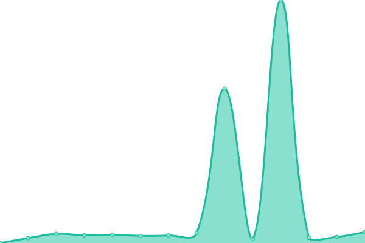

# [📈 Live Status](https://status.themanaworld.org): <!--live status--> **🟧 Partial outage**

This repository contains the open-source uptime monitor and status page for [The Mana World](https://themanaworld.org/), powered by [Upptime](https://github.com/upptime/upptime).

With [Upptime](https://upptime.js.org), you can get your own unlimited and free uptime monitor and status page, powered entirely by a GitHub repository. We use [Issues](https://github.com/themanaworld/upptime/issues) as incident reports, [Actions](https://github.com/themanaworld/upptime/actions) as uptime monitors, and [Pages](https://status.themanaworld.org) for the status page.

<!--start: status pages-->
<!-- This summary is generated by Upptime (https://github.com/upptime/upptime) -->
<!-- Do not edit this manually, your changes will be overwritten -->
<!-- prettier-ignore -->
| URL | Status | History | Response Time | Uptime |
| --- | ------ | ------- | ------------- | ------ |
|  [Azure] Azure VM | 🟩 Up | [azure-azure-vm.yml](https://github.com/themanaworld/upptime/commits/HEAD/history/azure-azure-vm.yml) | 

 121ms
     
 | 

<a href="https://status.themanaworld.org/history/azure-azure-vm">100.00%</a>
    

|  [Agnus] Agnus Dei VM | 🟩 Up | [agnus-agnus-dei-vm.yml](https://github.com/themanaworld/upptime/commits/HEAD/history/agnus-agnus-dei-vm.yml) | 

 124ms
     
 | 

<a href="https://status.themanaworld.org/history/agnus-agnus-dei-vm">100.00%</a>
    

|  [[Azure] Homepage](https://www.themanaworld.org) | 🟩 Up | [azure-homepage.yml](https://github.com/themanaworld/upptime/commits/HEAD/history/azure-homepage.yml) | 

 774ms
     
 | 

<a href="https://status.themanaworld.org/history/azure-homepage">98.34%</a>
    

|  [[Azure] Policies](https://policies.themanaworld.org) | 🟩 Up | [azure-policies.yml](https://github.com/themanaworld/upptime/commits/HEAD/history/azure-policies.yml) | 

 840ms
     
 | 

<a href="https://status.themanaworld.org/history/azure-policies">100.00%</a>
    

|  [[Azure] Forums](https://forums.themanaworld.org) | 🟩 Up | [azure-forums.yml](https://github.com/themanaworld/upptime/commits/HEAD/history/azure-forums.yml) | 

 976ms
     
 | 

<a href="https://status.themanaworld.org/history/azure-forums">100.00%</a>
    

|  [[Miraheze] Wiki](https://wiki.themanaworld.org) | 🟩 Up | [miraheze-wiki.yml](https://github.com/themanaworld/upptime/commits/HEAD/history/miraheze-wiki.yml) | 

 680ms
     
 | 

<a href="https://status.themanaworld.org/history/miraheze-wiki">100.00%</a>
    

|  [[Azure] Wiki](https://oldwiki.themanaworld.org) | 🟥 Down | [azure-wiki.yml](https://github.com/themanaworld/upptime/commits/HEAD/history/azure-wiki.yml) | 

 652ms
     
 | 

<a href="https://status.themanaworld.org/history/azure-wiki">0.00%</a>
    

|  [[FRS] ManaVerse](https://manaplus.germantmw.de) | 🟩 Up | [frs-mana-verse.yml](https://github.com/themanaworld/upptime/commits/HEAD/history/frs-mana-verse.yml) | 

 587ms
     
 | 

<a href="https://status.themanaworld.org/history/frs-mana-verse">100.00%</a>
    

|  [[Azure] Mana Launcher](https://api.themanaworld.org:13370/status/ping) | 🟩 Up | [azure-mana-launcher.yml](https://github.com/themanaworld/upptime/commits/HEAD/history/azure-mana-launcher.yml) | 

 484ms
     
 | 

<a href="https://status.themanaworld.org/history/azure-mana-launcher">100.00%</a>
    

|  [[Azure] Legacy API](https://api.themanaworld.org/api/tmwa/server) | 🟩 Up | [azure-legacy-api.yml](https://github.com/themanaworld/upptime/commits/HEAD/history/azure-legacy-api.yml) | 

 594ms
     
 | 

<a href="https://status.themanaworld.org/history/azure-legacy-api">100.00%</a>
    

|  [Azure] Legacy server | 🟩 Up | [azure-legacy-server.yml](https://github.com/themanaworld/upptime/commits/HEAD/history/azure-legacy-server.yml) | 

 121ms
     
 | 

<a href="https://status.themanaworld.org/history/azure-legacy-server">100.00%</a>
    

|  [Azure] Legacy Test server | 🟥 Down | [azure-legacy-test-server.yml](https://github.com/themanaworld/upptime/commits/HEAD/history/azure-legacy-test-server.yml) | 

 0ms
     
 | 

<a href="https://status.themanaworld.org/history/azure-legacy-test-server">100.00%</a>
    

|  [Azure] rEvolt server | 🟩 Up | [azure-r-evolt-server.yml](https://github.com/themanaworld/upptime/commits/HEAD/history/azure-r-evolt-server.yml) | 

 121ms
     
 | 

<a href="https://status.themanaworld.org/history/azure-r-evolt-server">100.00%</a>
    

|  [Azure] Crossroads server | 🟩 Up | [azure-crossroads-server.yml](https://github.com/themanaworld/upptime/commits/HEAD/history/azure-crossroads-server.yml) | 

 120ms
     
 | 

<a href="https://status.themanaworld.org/history/azure-crossroads-server">100.00%</a>
    

|  [Agnus] Moubootaur Legends server | 🟩 Up | [agnus-moubootaur-legends-server.yml](https://github.com/themanaworld/upptime/commits/HEAD/history/agnus-moubootaur-legends-server.yml) | 

 124ms
     
 | 

<a href="https://status.themanaworld.org/history/agnus-moubootaur-legends-server">100.00%</a>
    

|  [Agnus] Source of Mana server | 🟩 Up | [agnus-source-of-mana-server.yml](https://github.com/themanaworld/upptime/commits/HEAD/history/agnus-source-of-mana-server.yml) | 

 250ms
     
 | 

<a href="https://status.themanaworld.org/history/agnus-source-of-mana-server">100.00%</a>
    

|  [[Shivtr] Crew of Red Corsair](http://crc.themanaworld.org) | 🟩 Up | [shivtr-crew-of-red-corsair.yml](https://github.com/themanaworld/upptime/commits/HEAD/history/shivtr-crew-of-red-corsair.yml) | 

 612ms
     
 | 

<a href="https://status.themanaworld.org/history/shivtr-crew-of-red-corsair">98.76%</a>
    

|  [[Discord] Discord API](https://discord.com/api/v9) | 🟩 Up | [discord-discord-api.yml](https://github.com/themanaworld/upptime/commits/HEAD/history/discord-discord-api.yml) | 

 58ms
     
 | 

<a href="https://status.themanaworld.org/history/discord-discord-api">100.00%</a>
    

|  [[SMTP] Office 365](smtp.office365.com) | 🟩 Up | [smtp-office-365.yml](https://github.com/themanaworld/upptime/commits/HEAD/history/smtp-office-365.yml) | 

 1ms
     
 | 

<a href="https://status.themanaworld.org/history/smtp-office-365">100.00%</a>
    

<!--end: status pages-->

[**Visit our status website →**](https://status.themanaworld.org)

## 📄 License

- Powered by: [Upptime](https://github.com/upptime/upptime)
- Code: [MIT](./LICENSE) © [The Mana World](https://themanaworld.org/)
- Data in the `./history` directory: [Open Database License](https://opendatacommons.org/licenses/odbl/1-0/)
